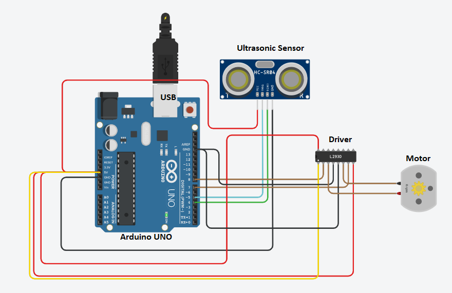

# Automatic & Touch-free Hand Santizer Dispenser  machine""''&copy;&trade;&reg;*

Local authority recognition 


## Field of the Invention 

This is an era of villainous COVID19. Avoiding physical contact is the most trusted weapon against it. So, we have tried to develop an **Automatic & Touch-free Hand Sanitiser Dispenser machine**.  Our innovation aims towards affordable healthcare products, without having any compromises on the build, as well as design.  
We have tried to develop a circuit board that contains an open-sourced *ATmega328p PU* microcontroller and its substituent components. The idea is to detect the distance of the object and compare it with the threshold. If we get an affirmative answer, run the motor automatically, which results in self dispense of sanitizing liquid. 
Our objective is to develop an *economic design* which should be :

**Affordable · Reliable · Customizable · Energy-Efficient · Noise-Free**


## Background of Invention
One evening I went to buy groceries. The shopkeeper looked very much irritated and tensed. On being asked he said he wanted to buy an automatic dispenser machine but unfortunately he could not afford it. After the return, I and my friends scraped the whole of various e-commerce websites. To our surprise, we found that not a single dispenser is below Rs 3000 even one with a capacity of 1L. 
We all know necessity is the mother of invention. After an exhaustive thought process and multiple debate, we decided to develop a machine that can automatically dispense sanitizer without any contact with an additional zeal of **Make in INDIA**. 

At first, we decided with the **finite automata** of the machine implemented using open-sourced *JFLAP* software. Then our concentration was focused on the prototype of the model. Empowered with basic knowledge of Microcontroller and Microprocessor we tried to develop a CPU that can *receive a high input signal and its ALU can convert it into the distance*. And that Logic system can be able to compare it with threshold according to our automata diagram. After a long failure, we designed an **ALU** which can compute our requirement. For this, we take the help of open-sourced software *Logisim*.

Then comes the time of prototype test, the test of our accuracy. For this, we have used an open-sourced *Arduino UNO board,  a motor driver, an ultrasonic sensor, a submersible motor, and a 5V battery*. Before the actual performance test, we tried to run our Arduino C program in online simulator *TinkerCAD*, where we can easily import the .obj file. At the end of the day, we were able to simulate. After this, we tried the code in our actual prototype and we were successful.

With the success of the prototype, we pushed the limit of 8*our goal to industrial production**. A customized PCB is modeled on the basis of the designed Schematic Diagram of our own chip for large scale production.

The Online *Easy EDA* tool is used for design purposes. In our innovative and economic design, we have used ATmega328p PU microcontroller, L293D motor driver, Ultrasonic sensor, 5V submersible motor, FTDI- USB to TTL driver, 16Mz oscillator and few capacitors for the safety of the circuit for smooth working in an unsimulated environment. In addition to these, we have designed a 3D model for the container almost similar to the prototype model.

Protoype 

## Prior Art details(Novelty)

### Price Comprasion
  
In the current market, broadly! there is two-division of a dispenser on the basis of capacity:

1. above 3 L 

2. below 3L.

Their market value varies a lot with the different brand names attached to them, but all of them cost above 3000 rupees in the Indian market. One with above 3L capacity can never be found below Rs 8000. In some cases, the price peaked at Rs 40000 with a capacity of only 5L. *Not a single disoenser was found below Rs3000* Even after going through a lot of e-commerce websites and physical searches in the vast market of Delhi we were unsuccessful to find an affordable dispenser. 

Whereas the overall cost of our prototype was Rs 600. After consulting certain business persons in the field and our domain expert professors, we came to the conclusion that the predicted cost of our whole design would be Rs 380 at max(dependent on stock market situation). This low production cost can be easily achieved in bulk order. After adding certain Logistics and labor costs with little miscellaneous charges, we can easily launch this product in the Indian market at Rs 600. It is approximately 30 % of the current market rate.

### Hardware

#### Sensor
One of the major differences is in the sensor. In all of the marketed product, they have used an infrared sensor with sensitivity radii of 15-20 cm. But we have used the Ultrasonic sensor and have fixed its threshold radii of 5-8cm.

To be clear our targetted market region is the whole country. And the fact u can find that weather varies frequently with the changes of the state-border. Keeping this constraint in mind we can claim that our Ultrasonic sensor is better than the IR sensor, and much more reliable. A sound wave can even detect in the night. But a frequent variation in light can significantly reduce the sensitivity of our competitor sensor.

#### Battery
We don't need higher threshold radii since we using a motor with a low potential requirement of 5 v at max in comparison to the 15-20 V motor used in the market. Thus they consume 20-40 W of power, ten times higher than our product(2W). 

>In our prototype, only 3 ml comes out in every flow.

#### FTDI USB to TTL driver

This plays a major booster in our design. We can easily customize our circuit, like changing the sensitivity radii. And easily reinstall the program if the microcontroller gets affected by the uncertain magnetic activity. 

#### Atmega328p PU

This microcontroller is one of the promising CPUs for embedded systems in the current era. Its RISCV Harvard architecture provides us a great deal of computation power with time efficiency.

#### Circuit design

We have customized the circuit and its PCB design according to our requirements keeping in mind the minimum PCB production cost.


#### 3D model

For all of the above changes, we have compromised with our container design. Although our wireframing has documented an ISI marked material but we have broadened the base of our container so that we can work with minimum power and low voltage motor. But the positive side of this compromise is that it can be easily installed in a high place. With the lower center of gravity(due to less height of container) comes higher stability. 

There is a sense of Multi-use in the Indian market. We can easily satisfy our customers since they can install it easily anywhere as per their wish. There will be no need for extra stress to mount it on the wall.

#### Capacity 

Since we are using a low powered motor we have wireframed our model for max 3L capacity.

#### Noise

In our testing with a lot of variation in power and voltage, we have concluded that it is also Noise free. So a better alternative to being installed inside a room or hall.


After a thorough comparison, we can conclude that our product can make a significant presence in the Indian market. We have a positive sense of vibes that we can efficiently deliver our goal of 

Affordable · Reliable · Customizable · Energy-Efficient · Noise-Free product.

This can be a great initiative under the **MAKE in INDIA** movement, strongly led by our *Honorable Prime Minister Shri Damadordas Narendra Modi*.

Feature of a current model in the market with less than 3L capacity 

Feature of a current model in the market with more than 3L capacity 

## Objects of Invention 

Every one of us knows that an ideal machine is just a hypothetical concept. Our design is not an exception. But we will first discuss our objective. 

We have intended to make the most *efficient product* with the least number of components so that it gives the most efficient performance, with the least chance of failure. And customizable enough to change only the basic required parts like power supply, sanitizer but not the chipset itself. Our goal is to make a system, in which price does not vary in huge amounts with further scaling up.

And we are capable of achieving a markable portion of objective like affordability, customizable and more reliable product. There is also a certain scope of improvement like better container design that will take less space. A high strength motor or the capacity for scaling up the liquid stored must be viewed from point of perfection.


## A detailed description of the Invention

### Software used :

#### JFLAP
>open sourced software

JFLAP is software for experimenting with formal languages topics including nondeterministic finite automata, nondeterministic pushdown automata, multi-tape Turing machines, several types of grammars, parsing, and L-systems.
 
  JFLAP allows one to experiment with construction proofs from one form to another, such as converting an NFA to a DFA to a minimal state DFA to a regular expression or regular grammar.


#### Logisim
>open sourced software

Logisim is an educational tool for designing and simulating digital logic circuits. With its simple toolbar interface and simulation of circuits as you build them, it is simple enough to facilitate learning the most basic concepts related to logic circuits. With the capacity to build larger circuits from smaller subcircuits, and to draw bundles of wires with single mouse drag, Logisim can be used (and is used) to design and simulate entire CPUs for educational purposes.


The open-source Arduino Software (IDE) makes it easy to write code and upload it to the board. It runs on Windows, Mac OS X, and Linux. 

The environment is written in Java and based on Processing and other open-source software.


#### Tinker CAD
>open community for students and creator

Tinkercad uses a simplified constructive solid geometry method of constructing models. A design is made up of primitive shapes that are either "solid" or "hole". Combining solids and holes, new shapes can be created, which in turn can be assigned the property of solid or hole. In addition to the standard library of primitive shapes, a user can create custom shape generators using a built-in JavaScript editor.

 Shapes can be imported in three formats: STL and OBJ for 3D, and 2- dimensional SVG shapes for extruding into 3D shapes. Tinkercad export models in STL or OBJ formats, ready for 3D printing.

#### Atmel Studio 7
>deugging tool

Atmel Studio 7. Studio 7 is the integrated development platform (IDP) for developing and debugging all AVR R and SAM microcontroller applications. ... It also connects seamlessly to the debuggers, programmers, and development kits that support AVR R and SAM devices. 

#### Online Easy EDA
>Online free tool for development

EasyEDA is a web-based EDA tool suite that enables hardware engineers to design, simulate, share - publicly and privately - and discuss schematics, simulations, and printed circuit boards. Other features include the creation of a bill of materials, Gerber files, and pick and place files and documentary outputs in PDF, PNG, and SVG formats.

### Program used:


#### ARDUINO C

Arduino is the hardware platform used to teach the C programming language as Arduino boards are available worldwide and contain the popular AVR microcontrollers from Atmel.

Atmel Studio is used as the development environment for writing C programs for AVR microcontrollers. It is a full-featured integrated development environment (IDE) that uses the GCC C software tools for AVR microcontrollers and is free to download.

#### Assembly Language

In computer programming, assembly language (or assembler language),[1] often abbreviated asm, is any low-level programming language in which there is a very strong correspondence between the instructions in the language and the architecture's machine code instructions.

### Components Used in prototype: 

#### Arduino UNO R3
>open sourced product

 Arduino Uno is a microcontroller board based on the ATmega328P (datasheet). It has 14 digital input/output pins (of which 6 can be used as PWM outputs), 6 analog inputs, a 16 MHz ceramic resonator (CSTCE16M0V53-R0), a USB connection, a power jack, an ICSP header, and a reset button. It contains everything needed to support the microcontroller; simply connect it to a computer with a USB cable or power it with an AC-to-DC adapter or battery to get started. 

#### Submersible Pump 

A submersible pump is a device which has a hermetically sealed motor close-coupled to the pump body. The whole assembly is submerged in the fluid to be pumped. The main advantage of this type of pump is that it prevents pump cavitation, a problem associated with a high elevation difference between the pump and the fluid surface. Submersible pumps push fluid to the surface as opposed to jet pumps which create a vacuum and rely upon atmospheric pressure. Submersibles use pressurized fluid from the surface to drive a hydraulic motor downhole, rather than an electric motor and are used in heavy oil applications with heated water as the motive fluid.

#### Ultrasonic Sensor 

 An ultrasonic sensor is an electronic device that measures the distance of a target object by emitting ultrasonic sound waves and converts the reflected sound into an electrical signal.

 Ultrasonic waves travel faster than the speed of audible sound (i.e. the sound that humans can hear). Ultrasonic sensors have two main components: the transmitter (which emits the sound using piezoelectric crystals) and the receiver (which encounters the sound after it has traveled to and from the target). To calculate the distance between the sensor and the object, the sensor measures the time it takes between the emission of the sound by the transmitter to its contact with the receiver. 

The formula for this calculation is D = 0.5 T x C (where D is the distance, T is the time, and C is the speed of sound 343 meters/second). For example, if a scientist set up an ultrasonic sensor aimed at a box and it took 0.025 seconds for the sound to bounce back, the distance between the ultrasonic sensor and the box would be:

 D = 0.5 x 0.025 x 343 or about 4.2875 meters. 

##### Hand Sanitizer

 Hand sanitizer is a liquid, gel, or foam generally used to decrease infectious agents on the hands. 

##### Jumping Wires 

A jump wire is an electrical wire, or group of them in a cable, with a connector or pin at each end.

##### L293D MOTOR DRIVER  

L293D is the I.C. in the motor driver. The motor driver is used to delivering power and input signal. It has 3 power supplies, one for 9v for the relay function, 5v for input from Arduino, Ground, and two inputs for each of the two motor circuits. We connect the input from Arduino, and for the motor to work, we provide with two data signals from the board, when both are high or both are low, the motor won't work as it won't provide with a polarity. Having on input low and one high would make a polarity for the direction of the motor.


---
We have completed our project in four Step:

1. Automata of our process
2. Datapath design
3. Prototype
    
        a. simulation
        b. Physical model
 4. Circuit Diagram
          
          a. Schematic Diagram 
          b. PCB Board
5. 3D model
##  1. Automata of our process

At the beginning of our process, we tried our knowledge gained in the theory of computation class. An automaton is designed to provide solid proof to an idea. Our idea was to create a machine that can *receive a high signal when an obstruction is detected and calculate the distance*. Then *compare it with threshold* and provides high signal to the driver when it is less. We have used open Sourced JFLAP software.

Finite automata of machine 

## 2. Datapath Design

Then comes the CPU design part. We have explicitly used open-sourced LOGISIM software.

We have designed a **21-bit width instruction register** stored in ROM which commands the *8bit*  RAM data to compute according to the control provided by the control unit and provide the signal to the motor.

Datapath map


##### Control Unit 

Control Unit is the part of the computer's central processing unit (CPU), which directs the operation of the microcontroller.  Control Unit to tell the computer's memory, arithmetic/logic unit, and input and output devices how to respond to the instructions that have been sent to the processor. It fetches internal instructions of the programs from the main memory to the processor instruction register, and based on this register contents, the control unit generates a control signal that supervises the execution of these instructions. 

We have used a 21-bit width splitter for the Control unit since our instruction is of 21-bit width.

##### ALU
An arithmetic logic unit (ALU) is a digital circuit used to perform arithmetic and logic operations. It represents the fundamental building block of the central processing unit (CPU) of a computer. In our, design ALU perform basic operation like multiplication, addition, XOR, OR, and comparison of two 8 bit binary number. after computing, it provides the high signal accordingly.

ALU 

Algorithm for our ALU computation
``` Algorithm
150149  ldi a, data 101010000000101001001
10a     mov b, a    000000000000100001010
150149  ldi a, data 
4504    mult a, b   000000100010100000100
150149  ldi a, result
10a     mov b,a
150149  ldi a, distance
4604    comp a, b   000000100011000000000
reutrn 
```
Register 
## 3. Prototype

#### WORKING

##### Algorithm for our code.
> 1. set trig pin and echo pin to 0.
> 2. With the delay of 2 ms set the trig pin to 1.
> 3. When echo will get a high input signal, calculate the time using the clock cycle.
> 4. Then calculate distance using d= time*0.034/2.
> 5. If the distance is less than 5 cm give a digital high signal to pump through Vcc and low signal through the ground pin.
> 6. And wait for 1750 ms. 

 our C code, Assembly code with Machine code C code :

``` python
#define echoPin 4
#define trigPin 5
#define pump 8
#define pump2 7
#define greenled 13
int long duration;
int distance;
void setup() 
{
  Serial.begin(9600);
  pinMode(echoPin,INPUT);
  pinMode(trigPin,OUTPUT);
  pinMode(pump, OUTPUT);
  pinMode(pump2, OUTPUT);
}

void loop() 
{
  digitalWrite(trigPin, LOW);
  delay(2); 
  digitalWrite(trigPin, HIGH);
  delay(10); 
  digitalWrite(trigPin, LOW);
  duration=pulseIn(echoPin, HIGH);
  distance=(duration*0.034/2);

  if(distance<=10)
  {
    digitalWrite(pump, HIGH);
    digitalWrite(pump2, LOW);
    delay(1500);
    digitalWrite(pump, LOW);
    delay(2000);
  }

}
``` 
#### Simulation 

For the initial testing of the proposed model, we have used the Arduino IDE simulator and import .obj file from Tinkercad software. Then we load the above program. After several bugs finding and debugging, finally, our simulator works according to our visualization.

Simulation


#### Prototype
Successful implementation paves the way for prototype testing. After collecting the required component with assembled them and connect it properly using jump wire. Then we upload the program in the bootloader connecting its USB port with our computer. There is a point to be noted that the C program is converted into a .hex file that is written in assembly language. Arm GCC compiler converts the C program in assembly code. For the container, we used a common container that can be easily found anywhere. 
It was a eureka moment when the first drop of liquid pumped out from the tiny nozzle.

Protoype


##  4. Circuit Diagram

This phase of development is subdivided into two parts: 

- Schematic Diagram
- PCB board design concept

###  Component used:

In our designed circuit we have used:

##### Atmega328P-PU

It is a high-performance Microchip 8-bit AVR RISC-based microcontroller combines 32KB ISP flash memory with read-while-write capabilities, 1KB EEPROM, 2KB SRAM, 23 general-purpose I/O lines, 32 general purpose working registers, three flexible timer/counters with compare modes, internal and external interrupts, serial programmable USART, a byte-oriented 2-wire serial interface, SPI serial port, 6-channel 10-bit A/D converter (8-channels in TQFP and QFN/MLF packages), programmable watchdog timer with internal oscillator, and five software selectable power saving modes. The device operates between 1.8-5.5 volts.

##### L293D Motor Driver

The L293D is a popular 16-Pin Motor Driver IC. As the name suggests it is mainly used to drive motors. A single L293D IC is capable of running two DC motors at the same time; also the direction of these two motors can be controlled independently. So if you have motors which have an operating voltage less than 36V and operating current less than 600mA, which are to be controlled by digital circuits like Op-Amp, 555 timers, digital gates or even Micron rollers like Arduino, PIC, ARM, etc.. this IC will be the right choice for us.

##### Ultrasonic Sensor (HC-SR04 )

the HC-SR04 Ultrasonic (US) sensor is a 4 pin module, whose pin names are Vcc, Trigger, Echo, and Ground respectively. This sensor is a very popular sensor used in many applications where measuring distance or sensing objects are required. The module has two eyes like projects in the front which form the Ultrasonic transmitter and Receiver. The sensor works with the simple high school formula that

Distance = Speed × Time

The Ultrasonic transmitter transmits an ultrasonic wave, this wave travels in the air and when it gets objected by any material it gets reflected toward the sensor this reflected wave is observed by the Ultrasonic receiver module as shown in the picture below


Now, to calculate the distance using the above formulae, we should know the Speed and time. Since we are using the Ultrasonic wave we know the universal speed of US wave at room conditions which is 330m/s. The circuitry inbuilt on the module will calculate the time taken for the US wave to come back and turns on the echo pin high for that same particular amount of time, this way we can also know the time taken. Now simply calculate the distance using a microcontroller or microprocessor.

Ultrasonic Sensor Working 

 ##### Submersible Pump 

A submersible pump is a device which has a hermetically sealed motor close-coupled to the pump body.


##### FTDI USB to TTL serial converter

The TTL-232R cables are a family of USB to TTL serial UART converter cables incorporating FTDI's FT232RQ USB to Serial UART interface IC device which handles all the USB signaling and protocols. The cables provide a fast, simple way to connect devices with a TTL level serial interface to USB. 

##### Basic Circuit components:

###### Capacitor

The capacitors are there to resonate with the crystal inductance and cause the crystal to oscillate on its fundamental parallel-resonant mode.
The reason that there are two capacitors in series is to create a network that creates a 180-degree phase inversion at resonance because the amplifier (inverter) has a 180-degree phase inversion between its input and output. This makes the loop gain have a net phase shift of 360 degrees, which is what causes it to oscillate

###### Resistor

A 10-ohm resistor is used with the 1uF capacitor to enable the RC circuit thus providing safety in unstimulated conditions.

###### Oscillator

A crystal oscillator is an electronic oscillator circuit that uses the mechanical resonance of a vibrating crystal of piezoelectric material to create an electrical signal with a precise frequency.

###### Power source

A 5v of the power supply is provided to the whole circuit.

###### Ground Source

All of the components are effectively grounded with the ground pin.

###### Wires

Wires and connectors are provided for the external components of our circuit.

#### Schematic Diagram : 

**Software:** *Easy EDA online*

For demonstrating a clean representation of our circuit and maintaining the transparency in our design, we have used an online Editor called **EasyEDA online**. 

We have efficiently designed the schematic diagram of the circuit used in our design.

Schematic Diagram 

#### PCB Design

We have used a doubled layered PCB board. In this sort of PCB, a thin layer of directing material, similar to copper is connected to both the best and base sides of the board. A 3D rendered model is provided below.

PCB 3D rendered 


PCB 2D rendered

  
```
U1: ATmega328p PU
U2: L293D driver
C1 & C2 : Capacitor 22uF
C3 : 10 uF
C4 : 1uF
S1 : USB pin
H1 : USB to TTL pin
M1 : motor pin
Q1 : register
```


## 5. 3D model:

A 3D model is also designed with the help of Tinkercad. In our design we have provide a space for motor in bottom portion like a well structure to obstruct the self flow of liquid due to gravity.

 Motor 

